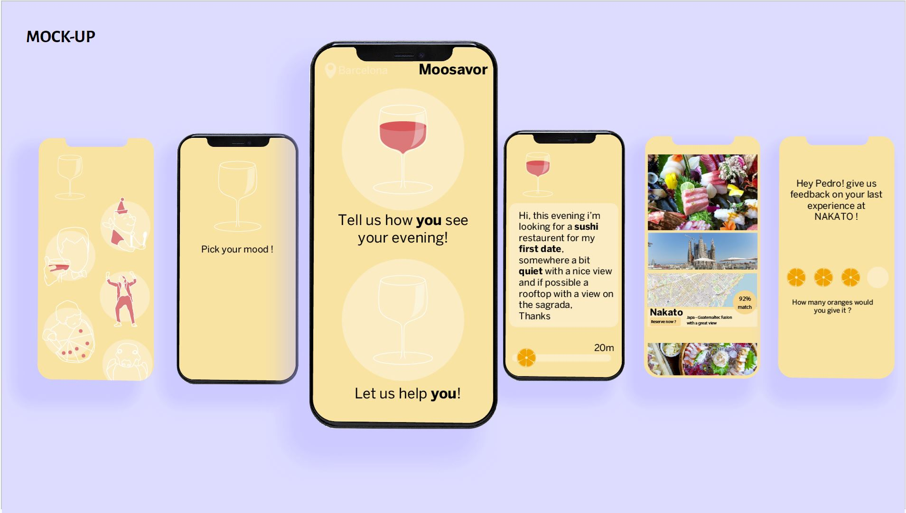
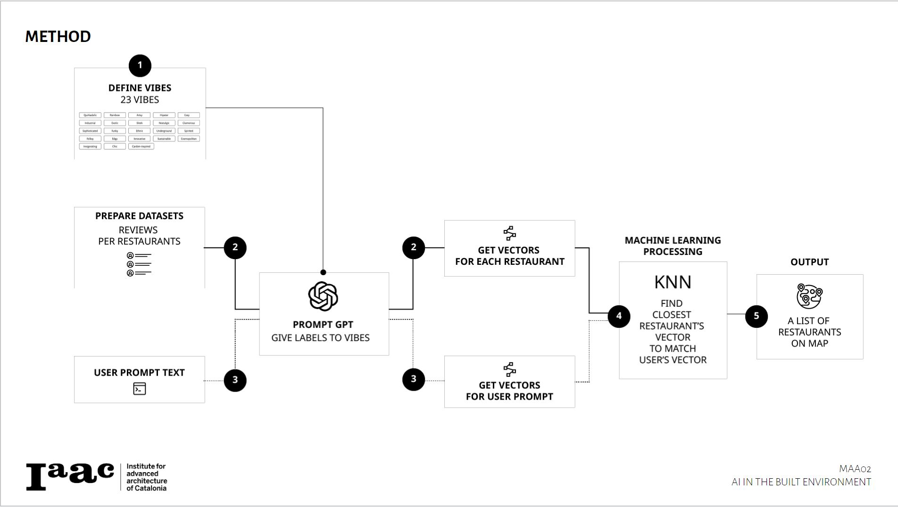

<!-- Improved compatibility of back to top link: See: https://github.com/GITHUBNAME/PROJECTNAME/pull/73 -->
<a name="readme-top"></a>

[![Contributors][contributors-shield]][contributors-url]
[![Forks][forks-shield]][forks-url]
[![Stargazers][stars-shield]][stars-url]
[![Issues][issues-shield]][issues-url]
[![MIT License][license-shield]][license-url]
[![LinkedIn][linkedin-shield]][linkedin-url]


<!-- PROJECT LOGO -->
<br />
<div align="center">
  <a href="https://github.com/GITHUBNAME/PROJECTNAME">
    
  </a>

  <h3 align="center"> MOODSAVVOR </h3>

  <p align="center" style="font-weight: bold;">
    IAAC: AI in the Built Environment
    <br />
    <a href="https://colab.research.google.com/github/GITHUBNAME/PROJECTNAME/blob/main/src/NOTEBOOKNAME.ipynb">View Demo</a>
    ·
    <a href="https://github.com/GITHUBNAME/PROJECTNAME/issues">Report Bug</a>
    ·
    <a href="https://github.com/GITHUBNAME/PROJECTNAME/issues">Request Feature</a>
  </p>
</div>


<!-- TABLE OF CONTENTS -->
<details>
  <summary>Table of Contents</summary>
  <ol>
    <li>
      <a href="#about-the-project">About The Project</a>
      <ul>
      <li><a href="#intro">Intro</a></li>
        <li><a href="#built-with">Built With</a></li>
        <li><a href="#methodology">Methodology</a></li>
      </ul>
    </li>
    <li>
      <a href="#getting-started">Getting Started</a>
      <ul>
        <li><a href="#prerequisites">Prerequisites</a></li>
        <li><a href="#usage">Usage</a></li>
      </ul>
    </li>
    <li><a href="#challenges">Challenges</a></li>
    <li><a href="#future-work">Future work</a></li>
    <li><a href="#license">License</a></li>
    <li><a href="#contact">Contact</a></li>
    <li><a href="#team">Team</a></li>
    <ul>
        <li><a href="#supervisors">Supervisors</a></li>
      </ul>
    <li><a href="#acknowledgements">More acknowledgements</a></li>
  </ol>
</details>


<!-- ABOUT THE PROJECT -->
## About The Project


Project developed under the course AI in the Built Environment 2022-23 in [IAAC](https://iaac.net/).

__Description:__ The project is an app prototype which enables the user to find the best suited restaurant depending on the user's requirements and preferences over various factors based on the list of restaurants available in the city of Barcelona \
 __Problem statement:__ The app provides a sulution in finding the best suited restaurant rather than bombard the user with information and makes the decision for them. This way the user saves time in terms of filtering information and decision making \
 __Idea:__ The team has created an app(prototype) to solve the filtering and decision making problem by letting the app do it for them \
 __Solution:__ The app makes decisions based on the reviews obtained online and performing unsupervised clustering to obtain the best suited restaurants \
 __Place:__ Barcelona \
 __Beneficiaries:__ Any person who wishes to obtain a place to eat


### Intro

Introducing our innovative app, designed to revolutionize your dining experience! By harnessing the power of Yelp's extensive database of information and user reviews, our app aims to help you find the best restaurants in your location. We understand that choosing a restaurant involves considering multiple factors, including reviews, vibes, price, rating, and distance. Our app takes all of these aspects into account, using a unique algorithm that assigns weights to each factor based on your preferences.

Employing the advanced technique of K-means clustering, our app analyzes the vast array of restaurant options and categorizes them into clusters based on their similarities. This allows us to identify the best-suited restaurants for you, tailored to your individual tastes and requirements. Whether you're seeking a trendy café, a budget-friendly eatery, or a highly-rated fine dining establishment, our app ensures that your dining choices align perfectly with your preferences.

Experience the convenience of having a personalized restaurant recommendation tool at your fingertips. Say goodbye to decision fatigue and let our app simplify your dining choices. Discover hidden culinary gems, explore new flavors, and embark on delightful gastronomic adventures with confidence. Download our app now and let us guide you to the best restaurants in your area, ensuring memorable dining experiences every time.

<p align="right">(<a href="#readme-top">back to top</a>)</p>


### Built With


* [python3](https://www.python.org/)
* [HTML](https://developer.mozilla.org/en-US/docs/Web/HTML)
* [sklearn](https://scikit-learn.org/stable/)
* [Yelp](https://www.yelp.se/stockholm)
* [OpenAI API](https://openai.com/product)
* [FastAPI](https://fastapi.tiangolo.com/)
* [Colab](https://colab.research.google.com/)

<p align="right">(<a href="#readme-top">back to top</a>)</p>


### Methodology




<!-- GETTING STARTED -->
## Getting Started

<a href="https://colab.research.google.com/github/AUTHORNAME/PROJECTNAME/blob/main/App.ipynb" target="_parent"></a>\
alternatively clone the repo:
```
git clone https://github.com/Akshay-Madapura/MoodSavvor.git
```

### Prerequisites
None
<p align="right">(<a href="#readme-top">back to top</a>)</p>
<!-- USAGE EXAMPLES -->

### Usage

To use the project follow these steps:\

* Step 1 : (Optional) Run the yelp file with your yelp API id and key to obtain the information to a csv file
* Step 2 : (Optional) Sort the information based on the vibes of your preferences. (The above steps may be skipped if using uploaded fike.)
* Step 3 : Upload file path of the sorted data to the APP file.
* Step 4 : Execute the file. Enter the prefered weights to factors based on preferences when prompted.
* Step 5 : Enter your prompt when prompted by GPT.
* Step 6 : Obtain a list of restaurants suited to you based on your prompts along with a graphical representation of the locations.

<p align="right">(<a href="#readme-top">back to top</a>)</p>

## Challenges

While working on the project the following challenges were encountered:
 
* challenge 1 : Sorting the obtained information.
* challenge 2 : Obtaining relaiable information and reviews.

<p align="right">(<a href="#readme-top">back to top</a>)</p>

## Future work

_Describe the potential improvements or developments of the project (e.g. deploy the project, add more cities, add support for some feature)._

- [x] step 1 : Deployment and further sophistication as an App.
- [ ] step 2 : Combined vibes to amount for combined values.
- [ ] step 3 : Expansive or real time information filtering 
- [ ] step 4 : Learning from user preferences.
- [ ] step 5 : Expanding to multiple cities and localities

<p align="right">(<a href="#readme-top">back to top</a>)</p>

<!-- LICENSE -->
## License

Distributed under the MIT License. See `LICENSE.txt` for more information.

<p align="right">(<a href="#readme-top">back to top</a>)</p>


## Contact

AUTHORNAME - [@Akshay-Madapura](https://github.com/Akshay-Madapura) - [e-mail : akshay.madapura@students.iaac.net](mailto:akshay.madapura@students.iaac.net) - [LinkedIn][linkedin-url]

<p align="right">(<a href="#readme-top">back to top</a>)</p>


<!-- ACKNOWLEDGMENTS -->
## Team
* Alessandra Weiss
* Yue Wu
* Akshay Madapura
* Alex Ferragu

<!-- <br />
<div style="width:100;" width=100%>
    <div>
        <a href="https://iaac.net">
            
        </a>
      <a href="https://iaac.net">
            
        </a>
      <a href="https://iaac.net">
            
        </a>
    </div> -->
  <h3>Supervisors</h3>
  <br />
    <div style="display:flex; flex-direction: row; flex:wrap; justify-content:space-around;">
        <a href="https://www.linkedin.com/in/angeloschronis/">
          
        </a>
        <a href="https://www.linkedin.com/in/serjoscha-d%C3%BCring-920644173/">
          
        </a>
        <a href="https://www.linkedin.com/in/stanislava-fedorova/">
          
        </a>
    </div>
</div>

## Acknowledgements

<br />
<div>
        <a href="https://iaac.net">
            
        </a>
    </div>
    <br />
* [Best README template](https://github.com/othneildrew/Best-README-Template)

<p align="right">(<a href="#readme-top">back to top</a>)</p>


<!-- MARKDOWN LINKS & IMAGES -->
<!-- https://www.markdownguide.org/basic-syntax/#reference-style-links -->
[contributors-shield]: https://img.shields.io/github/contributors/GITHUBNAME/PROJECTNAME.svg?style=for-the-badge
[contributors-url]: https://github.com/GITHUBNAME/PROJECTNAME/graphs/contributors
[forks-shield]: https://img.shields.io/github/forks/GITHUBNAME/PROJECTNAME.svg?style=for-the-badge
[forks-url]: https://github.com/GITHUBNAME/PROJECTNAME/network/members
[stars-shield]: https://img.shields.io/github/stars/GITHUBNAME/PROJECTNAME.svg?style=for-the-badge
[stars-url]: https://github.com/GITHUBNAME/PROJECTNAME/stargazers
[issues-shield]: https://img.shields.io/github/issues/GITHUBNAME/PROJECTNAME.svg?style=for-the-badge
[issues-url]: https://github.com/GITHUBNAME/PROJECTNAME/issues
[license-shield]: https://img.shields.io/github/license/GITHUBNAME/PROJECTNAME.svg?style=for-the-badge
[license-url]: https://github.com/GITHUBNAME/PROJECTNAME/blob/master/LICENSE.txt
[linkedin-shield]: https://img.shields.io/badge/-LinkedIn-black.svg?style=for-the-badge&logo=linkedin&colorB=555
[linkedin-url]: https://linkedin.com/in/stanislava-fedorova
[product-screenshot]: assets/screenshot.png


